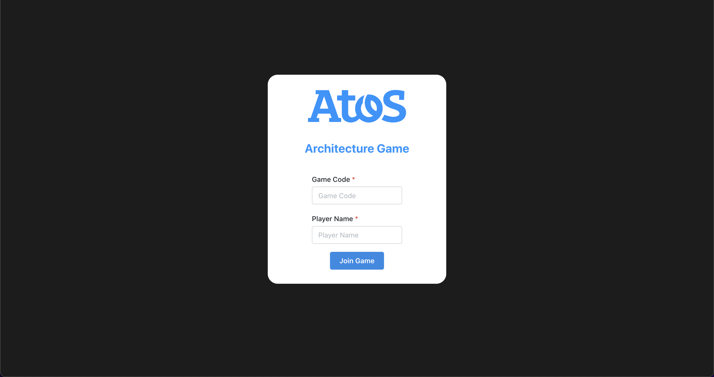

# Atos web

<div id="top"></div>
<!-- PROJECT LOGO -->
<br />
<div align="center">
  <a href="https://github.com/github_username/repo_name">
    
  </a>

<h3 align="center">Frontend</h3>

  <p align="center">
    The player frontend of the Atos card game
    <br />
    <a href="https://github.com/github_username/repo_name"><strong>Explore the docs »</strong></a>
    <br />
    <br />
</div>

<!-- ABOUT THE PROJECT -->
## About The Component



This is the main frontend for the Atos card game. This service handles the main game logic and also currently holds the admin lobby logic (should be moved to the admin-view)

<p align="right">(<a href="#top">back to top</a>)</p>


### Built With

* [React.js](https://reactjs.org/)

<p align="right">(<a href="#top">back to top</a>)</p>


<!-- GETTING STARTED -->
## Getting Started

The first step you will want to do when getting the app ready is clone the github repository.

### Prerequisites

This is an example of how to list things you need to use the software and how to install them.
* npm
  ```sh
  npm install npm@latest -g
  ```

* yarn
  ```sh
  npm install --global yarn
  ```

We **strongly** advise using yarn as the default package manager when interacting with this project.

### Installation

1. Clone the repository and install the dependencies using
   bash
   yarn install
2. Copy the `.env.example` file to a `.env` and edit the values to match your environment.
3. We can start the application in development mode using
   bash
   yarn start:dev
<!-- USAGE EXAMPLES -->

## Usage

For development, you can use the OpenAPI Swagger documentation available at `localhost:port/docs/admin-service`.


<!-- USAGE EXAMPLES -->
## Usage


The frontend currently has 3 urls.

* /join - join lobby url
* /game - game view for the players
* /admin/lobbies - Microsoft Active Directories protected url for admins for lobby management.
This should be moved to the admin view, but we did not have time!


_For more examples and information, please refer to the [Documentation](https://example.com)_

<p align="right">(<a href="#top">back to top</a>)</p>

<!-- CONTACT -->
## Contact

* Functionality - Rares P. - r.petrisor@student.fontys.nl
* Functionality & Styling - Vladimir A. - v.abuhnoaei@student.fontys.nl

<p align="right">(<a href="#top">back to top</a>)</p>

